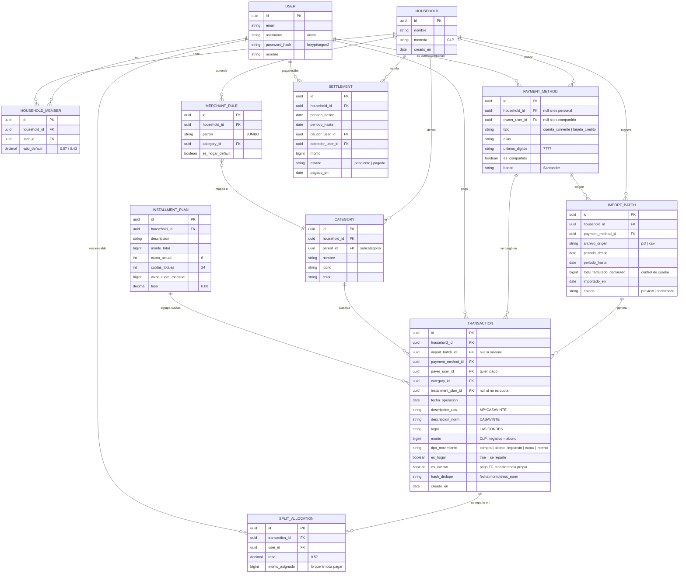

# Documento Técnico de Ingeniería (ERD + Especificaciones)

**Producto:** *NuestraCuenta* — App de gastos compartidos del departamento
**Versión:** 1.0 (borrador)
**Acompaña a:** PRD_Gastos_Compartidos.md
**Fecha:** Junio 2026

Este documento define el **modelo de datos (ERD)**, la **arquitectura**, la **especificación del parser de cartola**, el **motor de categorización** y el **motor de reparto/liquidación**. El modelo se derivó del estado de cuenta Santander de ejemplo.

---

## 1. Arquitectura propuesta

Recomendación para un MVP de pareja (2 usuarios), priorizando privacidad y baja fricción:

- **Frontend:** PWA (React) — funciona en navegador móvil sin instalar; instalable a pantalla de inicio.
- **Backend:** **FastAPI (Python)** — API REST. Stack sugerido: SQLAlchemy + Alembic (migraciones), Pydantic para schemas, Uvicorn como servidor ASGI.
- **Base de datos:** PostgreSQL (relacional; el dominio es claramente relacional).
- **Ingesta de cartola (vía principal): PDF crudo con `pdfplumber`.** El usuario sube el PDF del estado de cuenta Santander; el backend lo procesa con `pdfplumber` y devuelve los movimientos estructurados para el preview. (CSV queda como vía secundaria/opcional para bancos sin PDF tabular).
- **Auth:** **propia, usuario + contraseña hasheada en la BD** (sin proveedor externo). Hash con `passlib[bcrypt]` (o `argon2`). Tokens de sesión vía JWT (`python-jose`) o cookie de sesión.

> Si se opta por **buy** en la ingesta (piggi/mAImoney/Fintoc), el backend propio se concentra en las entidades de **reparto y liquidación** y consume movimientos ya categorizados.

---

## 2. Modelo de datos (ERD)

### 2.1 Diagrama entidad-relación



### 2.2 Notas de diseño del modelo

- **`SPLIT_ALLOCATION`** materializa el reparto: una fila por persona y por transacción del hogar, con su `ratio` y su `monto_asignado`. Esto permite overrides por gasto (50/50, 100% A) sin tocar el ratio del Hogar.
- **`payer_user_id`** (quién pagó) es independiente del split (quién *debe* pagar). Esta separación es lo que resuelve el caso “gasto del hogar pagado con tarjeta personal”.
- **`es_interno`** marca movimientos como el pago de la tarjeta (`MONTO CANCELADO`) o transferencias entre cuentas propias → se excluyen del gasto y del reparto.
- **`INSTALLMENT_PLAN`** modela las compras en cuotas; cada cargo mensual es una `TRANSACTION` con `tipo_movimiento = cuota` ligada al plan, usando `valor_cuota_mensual` como monto del mes.
- **`hash_dedupe`** habilita la detección de duplicados entre importaciones y contra gastos manuales.

---

## 3. Diccionario de datos clave

| Entidad | Campo | Descripción / regla |
|---|---|---|
| HOUSEHOLD_MEMBER | `ratio_default` | Proporción del hogar. Suma de los 2 miembros = 1.00 (ej. 0.57 + 0.43). |
| PAYMENT_METHOD | `es_compartido` | `true` para cuenta corriente y TC del depto; `false` para tarjetas personales. |
| TRANSACTION | `monto` | Entero en CLP (sin decimales). Negativo = abono/nota de crédito. |
| TRANSACTION | `es_hogar` | Si `true`, genera `SPLIT_ALLOCATION`. Si `false`, es 100% del pagador. |
| TRANSACTION | `tipo_movimiento` | `compra`, `abono`, `impuesto`, `cuota`, `interno`. |
| TRANSACTION | `descripcion_norm` | Descripción limpia (prefijos de pasarela removidos) para reglas y dedupe. |
| IMPORT_BATCH | `total_facturado_declarado` | El “Monto Total Facturado a Pagar” impreso; se usa para validar el cuadre. |

---

## 4. Especificación del parser de cartola (Santander)

### 4.1 Mapeo de columnas (sección “2. PERIODO ACTUAL”)

Columnas de la cartola → campos del modelo:

| Columna cartola | Campo destino |
|---|---|
| LUGAR DE OPERACIÓN | `transaction.lugar` |
| FECHA DE OPERACIÓN | `transaction.fecha_operacion` (formato `dd/mm/aaaa`) |
| DESCRIPCIÓN OPERACIÓN O COBRO | `transaction.descripcion_raw` |
| ORIGEN (`CUOTA COMERCIO`, `TRES CUOTAS PREC`, etc.) | señal de `installment_plan` |
| MONTO ORIGEN OPERACIÓN | `installment_plan.monto_total` |
| MONTO TOTAL A PAGAR | total de la compra en cuotas |
| Nº CUOTA (`06/24`) | `cuota_actual` / `cuotas_totales` |
| VALOR CUOTA MENSUAL | `installment_plan.valor_cuota_mensual` y `transaction.monto` del mes |
| (monto simple, ej. `$208.524`) | `transaction.monto` |

### 4.2 Reglas de procesamiento por sección

La cartola tiene 4 sub-secciones; el parser debe tratarlas distinto:

1. **`1. TOTAL OPERACIONES` / `MOVIMIENTOS TARJETA`** → compras normales y cuotas vigentes.
2. **`2. PRODUCTOS O SERVICIOS VOLUNTARIAMENTE CONTRATADOS`** → seguros/servicios; categoría especial.
3. **`3. CARGOS, COMISIONES, IMPUESTOS Y ABONOS`** → `IMPTO. DECRETO LEY 3475` (impuesto), `NOTA DE CREDITO` (abono negativo).
4. **`4. INFORMACION COMPRAS EN CUOTAS EN EL PERIODO`** → crea `INSTALLMENT_PLAN` nuevo (no doble-contar contra la sección 1).

### 4.3 Reglas obligatorias

- **Excluir internos:** `MONTO CANCELADO` → `tipo_movimiento = interno`, `es_interno = true`, desmarcado por defecto en el preview.
- **Signo:** respetar negativos (`NOTA DE CREDITO $ -499.990`) como abonos; **no** convertir a positivo.
- **Cuotas:** cuando hay `Nº CUOTA` y `VALOR CUOTA MENSUAL`, el monto del mes es **la cuota**, no el total. Vincular a `INSTALLMENT_PLAN`.
- **Normalización de descripción:** remover prefijos de pasarela para `descripcion_norm`:
  `MP*`, `MERCADOPAGO*`, `MERPAGO*`, `DP *`, `FLOW *`, `PedidosYa*`. Ej.: `MP*CASAVINTE` → `CASAVINTE`.
- **Control de cuadre (integridad):** `Σ(montos a pagar del periodo) == total_facturado_declarado`. Si no calza, advertir en el preview (no bloquear). *Referencia: la cartola de ejemplo declara `MONTO TOTAL FACTURADO A PAGAR $ 2.613.704`.*
- **Dedupe:** `hash_dedupe = normalizar(fecha_operacion + '|' + monto + '|' + descripcion_norm)`. Si ya existe en el Hogar, marcar como posible duplicado en el preview.

### 4.4 Pipeline de extracción con `pdfplumber` (vía principal)

El PDF Santander es tabular y consistente entre periodos, lo que lo hace apto para extracción determinística (sin OCR, porque es texto nativo). Pipeline:

```
1. Recibir el PDF subido (multipart) en FastAPI → guardar en tmp cifrado.
2. Abrir con pdfplumber: for page in pdf.pages
3. Anclar por cabeceras de sección ("2. PERIODO ACTUAL",
   "3. CARGOS, COMISIONES, IMPUESTOS Y ABONOS",
   "4. INFORMACION COMPRAS EN CUOTAS EN EL PERIODO").
4. Extraer filas con page.extract_table() / extract_words() y
   reconstruir columnas por posición x (la tabla no siempre trae
   bordes limpios → usar 'text' strategy y tolerancias).
5. Parsear cada fila → dict {lugar, fecha, descripcion, origen,
   monto, nro_cuota, valor_cuota}.
6. Normalizar montos chilenos: "$ 1.268.949" → 1268949 (quitar
   "$", puntos de miles; signo negativo = abono).
7. Aplicar reglas de la sección 4.2 y 4.3 (secciones, signos, cuotas, internos).
8. Validar cuadre contra "MONTO TOTAL FACTURADO A PAGAR".
9. Devolver JSON de movimientos para el preview. Borrar el tmp tras procesar.
```

Consideraciones de robustez:

- **Multipágina:** los movimientos del periodo se extienden por varias páginas (en el ejemplo, páginas 1–3). Acumular filas a través de páginas hasta cerrar cada sección.
- **Filas envueltas:** una compra en cuotas ocupa columnas extra (origen, monto total, Nº cuota, valor cuota). Detectar por presencia de `Nº CUOTA` (`06/24`) o de `ORIGEN` con texto de cuotas.
- **Montos con signo:** capturar el `-` de `NOTA DE CREDITO` y `MONTO CANCELADO`.
- **Cabecera del batch:** extraer `NOMBRE DEL TITULAR`, `Nº DE TARJETA` (últimos 4), `PERIODO FACTURADO desde/hasta`, `PAGAR HASTA` y `MONTO TOTAL FACTURADO A PAGAR` para poblar `IMPORT_BATCH`.
- **Test de regresión:** fijar el PDF de ejemplo como fixture y verificar que el parser produce exactamente los movimientos esperados (ver sección 9).

> CSV: si más adelante se soporta, reutiliza desde el paso 6 en adelante (mismo pipeline de normalización y reglas).

---

## 5. Motor de categorización

1. **Reglas semilla:** diccionario inicial de comercios chilenos → categoría (Jumbo/Lider/Unimarc/Tottus → Supermercado; Sodimac/Easy/Ferretería → Hogar; PedidosYa/Uber Eats → Delivery; Enel/Aguas Andinas → Servicios básicos; Telefónica → Telecom; Cinemark → Entretención; etc.).
2. **Match por `descripcion_norm`** (substring / patrón).
3. **Aprendizaje:** cuando el usuario corrige una categoría, crear/actualizar un `MERCHANT_RULE` para el Hogar. La próxima vez ese comercio se categoriza solo.
4. **Default:** si no hay match, categoría “Otros” y queda visible para revisión.

> Meta MVP: ≥ 70% de movimientos auto-categorizados con la semilla.

---

## 6. Motor de reparto y liquidación

### 6.1 Cálculo del split (por transacción del hogar)

```
para cada TRANSACTION con es_hogar = true:
    para cada miembro m del hogar:
        ratio_m = override_de_la_tx ?? ratio_default_de_m   # ej. 0.57 / 0.43
        monto_asignado_m = round(monto * ratio_m)
    # ajuste de redondeo: la suma de asignados debe igualar monto exacto
    corregir_ultimo_peso_por_redondeo()
    crear SPLIT_ALLOCATION por miembro
```

- Si `es_hogar = false`: no se crea split; el gasto es 100% del `payer_user_id`.
- Si la transacción es un **abono** (negativo), el split también es negativo (reduce la deuda proporcionalmente).

### 6.2 Cálculo de la liquidación del periodo

```
para cada miembro m:
    pagado_m   = Σ monto de TRANSACTIONS del hogar donde payer = m   (lo que desembolsó)
    debido_m   = Σ monto_asignado de SPLIT_ALLOCATION donde user = m  (lo que le correspondía)
    balance_m  = pagado_m - debido_m

# balance_m > 0  → a m le deben
# balance_m < 0  → m debe
crear SETTLEMENT: el de balance negativo paga al de balance positivo por |min|
```

**Ejemplo (validación del modelo):**
- Gasto del hogar: $20.000, pagado por **B** (tarjeta personal). Ratio A=0.57, B=0.43.
- Asignado: A = $11.400, B = $8.600.
- `pagado`: A=$0, B=$20.000. `debido`: A=$11.400, B=$8.600.
- `balance`: A = −$11.400, B = +$11.400 → **A le debe $11.400 a B.** ✔️

### 6.3 Registro del pago

Al transferirse, se marca el `SETTLEMENT` como `pagado` con fecha. El saldo del periodo queda en cero.

---

## 7. API (esbozo REST)

| Método | Endpoint | Descripción |
|---|---|---|
| POST | `/auth/register` | Crear usuario (guarda `password_hash` con bcrypt) |
| POST | `/auth/login` | Validar credenciales → devuelve JWT/sesión |
| GET | `/auth/me` | Usuario autenticado actual |
| POST | `/households` | Crear hogar + ratio default |
| POST | `/households/{id}/members` | Invitar/agregar pareja |
| POST | `/households/{id}/payment-methods` | Registrar cuenta/tarjeta |
| GET/POST | `/households/{id}/categories` | Listar/crear categorías |
| POST | `/households/{id}/transactions` | Imputación manual |
| POST | `/households/{id}/imports` | Subir **PDF** de cartola (multipart) → parsea con `pdfplumber` y devuelve preview (no confirma) |
| PATCH | `/imports/{id}/items` | Desmarcar/editar categoría en preview |
| POST | `/imports/{id}/confirm` | Inyectar movimientos confirmados |
| GET | `/households/{id}/settlement?desde=&hasta=` | Liquidación del periodo |
| POST | `/settlements/{id}/pay` | Marcar liquidación como pagada |
| GET | `/households/{id}/reports` | Dashboard (por categoría, por persona, evolución, cuotas futuras) |

---

## 8. Seguridad y privacidad

- **Contraseñas:** nunca en texto plano. Se guarda solo `password_hash` (bcrypt o argon2 vía `passlib`); el login compara hashes. No reversible.
- **Sesión:** JWT firmado (secreto en variable de entorno) o cookie de sesión `HttpOnly` + `Secure`.
- Datos del Hogar accesibles **solo** por sus 2 miembros (autorización por `household_id` en cada endpoint).
- **Nunca** solicitar credenciales bancarias; el PDF lo descarga el usuario desde su banca.
- **Manejo del PDF:** se procesa server-side con `pdfplumber`, se guarda en un tmp **cifrado** y se **borra inmediatamente** tras extraer los movimientos. No se persiste el archivo crudo, solo los movimientos estructurados.
- Cifrado en tránsito (TLS) y en reposo para montos/descripciones.
- PIN/biometría opcional para abrir la app (referencia: Wallet/Money Flow).

---

## 9. Criterios de aceptación técnicos (pruebas)

Casos de prueba mínimos sobre la cartola de ejemplo:

1. **Excluir interno:** `MONTO CANCELADO $ -1.183.658` no entra al gasto ni a la liquidación.
2. **Nota de crédito:** `NOTA DE CREDITO $ -499.990` se registra como abono y resta de su categoría.
3. **Impuesto:** `IMPTO. DECRETO LEY 3475 $ 7.600` → categoría Impuestos.
4. **Cuota vigente:** `MACONLINE 06/24` aporta **$52.873** al mes, no $1.268.949.
5. **Cuota nueva:** `FLOW *SAMSUNG 12 CUOTAS` crea `INSTALLMENT_PLAN` con `valor_cuota_mensual $79.166` y proyecta cuotas futuras.
6. **Normalización:** `MP*CASAVINTE` y `MERCADOPAGO*MERCADOLIBRE` se limpian correctamente.
7. **Split 57/43:** un gasto de $100.000 del hogar asigna $57.000 / $43.000 (sin perder pesos por redondeo).
8. **Tarjeta personal:** gasto del hogar pagado por B genera deuda de A hacia B por la parte de A.
9. **Cuadre:** la suma del periodo se compara contra `$2.613.704` y advierte si difiere.
10. **Dedupe:** subir la misma cartola dos veces no duplica movimientos.
```

